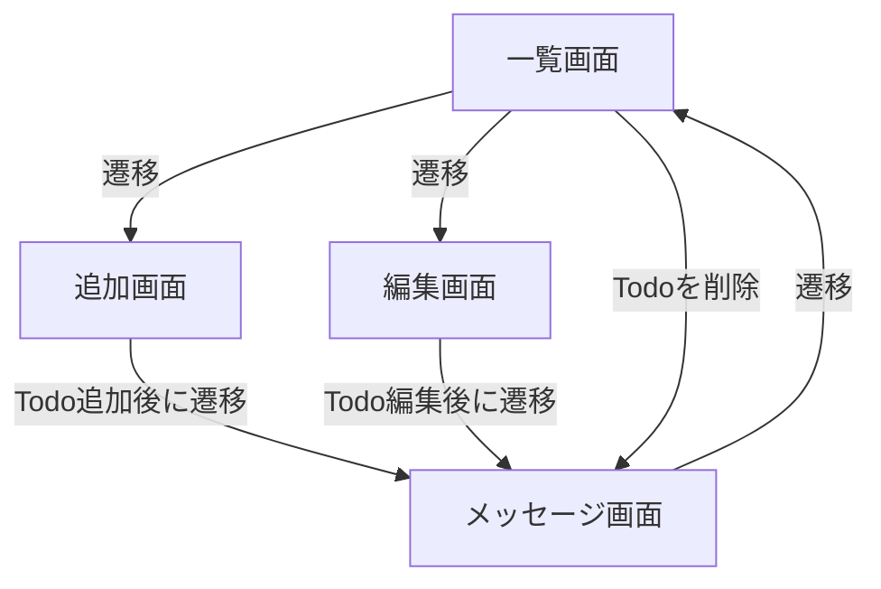
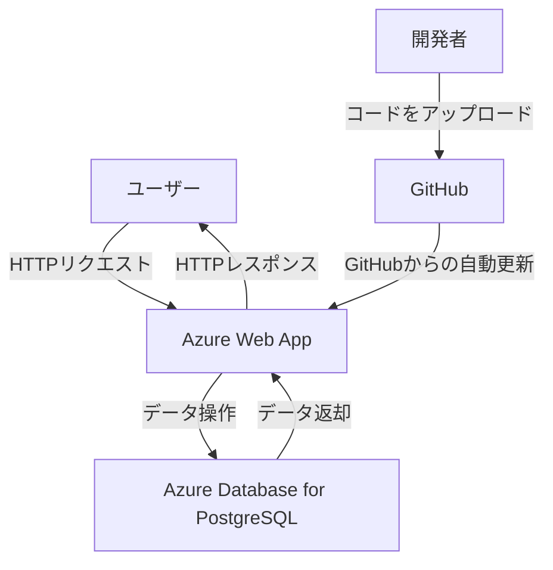

```mermaid
graph TD;
    A[一覧画面] -->|遷移| C[追加画面];
    C[追加画面] -->|Todo追加後に遷移| E[メッセージ画面];
    A[一覧画面] -->|遷移| F[編集画面];
    F[編集画面] -->|Todo編集後に遷移| E[メッセージ画面];
    A[一覧画面] -->|Todoを削除| E[メッセージ画面];
    E[メッセージ画面] -->|遷移| A[一覧画面];

```

```mermaid
graph TD;
    A[ユーザー] -->|HTTPリクエスト| B[Azure Web App];
    B[Azure Web App] -->|データ操作| C[Azure Database for PostgreSQL];
    C[Azure Database for PostgreSQL] -->|データ返却| B[Azure Web App];
    B[Azure Web App] -->|HTTPレスポンス| A[ユーザー];
    D[GitHub] -->|GitHubからの自動更新| B[Azure Web App];
    E[開発者] -->|コードをアップロード| D[GitHub]

```
